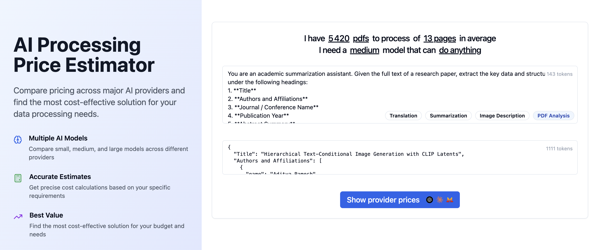

# APPE: AI Processing Price Estimator

A comprehensive web application that helps you estimate and compare costs across major AI providers (OpenAI, Claude, Mistral) for different types of data processing tasks.



## 🚀 Features

### Multi-Provider Cost Comparison

- Compare pricing across **OpenAI**, **Claude**, and **Mistral** models
- Support for small, medium, and large model tiers
- Real-time cost calculations based on token usage

### Data Type Support

- **Text Prompts**: Standard text processing and generation
- **Images**: Image analysis with size-based token calculation
- **PDFs**: Document processing with page-based token estimation

### Advanced Token Estimation

- Accurate token counting for input and output
- Provider-specific image token calculations
- Batch processing cost estimates

### Interactive Features

- **Live Results**: Real-time pricing updates as you modify inputs
- **Export Options**: Download results as images or copy as text
- **Example Templates**: Pre-built templates for common use cases
- **Model Filtering**: Filter by provider, model size, and capabilities

### Visual Analytics

- Price range visualization with cost comparisons
- Token breakdown (input vs output)
- Best value recommendations
- Interactive charts and summaries

## 📋 Use Cases

- **Content Creation**: Estimate costs for generating articles, summaries, or translations
- **Image Analysis**: Calculate expenses for image description and analysis tasks
- **Document Processing**: Budget for PDF analysis and extraction workflows
- **API Planning**: Compare providers before implementing AI features
- **Cost Optimization**: Find the most cost-effective models for your specific needs

## 🛠️ Technology Stack

- **Frontend**: React 18 with TypeScript
- **Styling**: Tailwind CSS with shadcn/ui components
- **Build Tool**: Vite
- **Form Management**: React Hook Form
- **State Management**: React Context API
- **Icons**: Lucide React

## 🏃‍♂️ Getting Started

### Prerequisites

- Node.js (recommended: install with [nvm](https://github.com/nvm-sh/nvm#installing-and-updating))
- npm

### Installation

1. **Clone the repository**

   ```bash
   git clone <YOUR_GIT_URL>
   cd prompt-price-predictor
   ```

2. **Install dependencies**

   ```bash
   npm install
   ```

3. **Start development server**

   ```bash
   npm run dev
   ```

4. **Open your browser**
   Navigate to `http://localhost:5173`

## 📖 How to Use

### Basic Workflow

1. **Select Data Type**: Choose between prompts, images, or PDFs
2. **Enter Your Prompt**: Describe the task you want the AI to perform
3. **Provide Example Output**: Show what kind of response you expect
4. **Set Data Count**: Specify how many items you want to process
5. **Configure Options**: Select model size and capabilities if needed
6. **View Results**: Compare costs across all providers and models

### Example Scenarios

#### Text Summarization

```
Data Type: Prompts
Prompt: "Summarize the following article: [article text]"
Example: "Brief summary highlighting key points..."
Data Count: 100 articles
```

#### Image Description

```
Data Type: Images
Prompt: "Describe the content of this image"
Example: "The image shows a sunset over mountains..."
Data Count: 500 images
Image Size: 1024x1024
```

#### PDF Analysis

```
Data Type: PDFs
Prompt: "Extract key information from this research paper"
Example: "Title: ..., Authors: ..., Key Findings: ..."
Data Count: 50 documents
```

## 📊 Model Support

The application includes comprehensive model data for:

- **OpenAI**: GPT-4, GPT-3.5, and various specialized models
- **Claude**: Haiku, Sonnet, and Opus variants
- **Mistral**: Small, medium, and large models

Each model includes:

- Input/output token costs
- Context window sizes
- Capability tags (vision, code, multilingual, reasoning)
- Model tier classifications

## 🎨 Features in Detail

### Token Estimation

- **Text**: ~4 characters per token estimation
- **Images**: Provider-specific calculations (Claude: width×height/750, OpenAI: complex tile-based)
- **PDFs**: Page-based token multiplication

### Export Options

- **Image Export**: Generate shareable cost estimation graphics
- **Text Export**: Copy formatted results to clipboard
- **Summary Cards**: Visual cost breakdowns

### Filtering & Search

- Filter by provider, model tier, or capabilities
- Search models by name
- Sort results by cost or performance

---

Built with ❤️ using React, TypeScript, and Tailwind CSS
