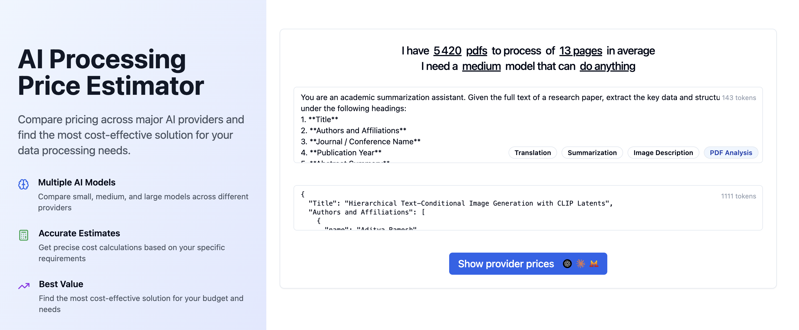

# APPE — AI Processing Price Estimator

Describe an AI task in plain words, get a trustworthy cost figure. APPE compares
what that task would cost across **~4,900 models from ~144 providers**, with the
maths open to inspection.

**Live:** https://appe.dev.gabvdl.xyz · **License:** [MIT](LICENSE) · **Where
this is going:** [GOAL.md](GOAL.md)



The unit of input is a *task* ("summarise 10k support tickets", "describe 500
product photos"), not a token count — the token count is exactly what you don't
know yet. APPE estimates the tokens, applies each model's real published prices,
and ranks the results.

It is deliberately neutral: no account, no backend, no telemetry, no upsell. The
model catalogue is not hand-maintained — it is synced daily from the open
[models.dev](https://models.dev) database, so a wrong price is a bug that gets
fixed upstream rather than a number someone chose.

## What it does

- **Compare every provider, not three.** The same base model is listed under many
  providers at different prices, and each provider×model pair is its own row — so
  "where should I buy Llama 3.3" is an answerable question.
- **Four input types**: text prompts, images (provider-specific tiling), PDFs
  (per-page tokens, or per-page pricing where the provider bills that way) and
  audio (duration × tokens/second, at the model's dedicated audio rate when one
  exists).
- **Batch discounts**, cached-input rates and context-window limits come from the
  catalogue rather than from assumptions.
- **Filter and rank** by provider, tier (small/medium/large) and capability tags
  (vision, audio, video, reasoning, tools, opensource).
- **Shareable estimates** — the whole form state is encoded in the URL, so a
  permalink reproduces someone else's numbers exactly.

## Quick start

Requirements: Node.js 18+ (install via [nvm](https://github.com/nvm-sh/nvm)) and
npm.

```bash
git clone https://github.com/GabrielVidal1/appe
cd appe
npm install
npm run dev          # http://localhost:8080
```

Other commands:

```bash
npm run build                            # type-checked production build
npm test                                 # vitest — estimator unit tests
npm run test:watch                       # vitest in watch mode
npm run lint                             # eslint
npx tsc --noEmit -p tsconfig.app.json    # typecheck only
node scripts/sync-models.mjs             # refresh the model + logo catalogue
npm run deploy                           # build + deploy (maintainer only)
```

## How the estimate is computed

Everything lives in **`packages/core`** (the `@appe/core` workspace package) and
is plain TypeScript — no React, no server. The web app is only a front-end over
it, and the planned `appe` CLI will import the same functions, so the two can
never disagree about a number. Read it; that's the point.

1. **Tokens** (`core/computations.ts`, `core/tokenization/`) — the prompt and the
   example output are tokenized with the OpenAI `o200k` tokenizer (its rank table
   is fetched once from `tiktoken.pages.dev`; until it lands, a synchronous
   ~4-chars/token approximation is used). Non-text input adds to the input side:
   - *images* — `core/imageCost.ts` applies the provider's own rule (Anthropic:
     `width × height / 750`; OpenAI: tile-based; otherwise a default), and uses a
     provider's flat per-image price when it publishes one.
   - *PDFs* — `pages × tokensPerPage`, unless the provider prices per page.
   - *audio* — `seconds × tokensPerSecond` (default 32, editable).
2. **Price** (`computePrices`) — input and output tokens are multiplied by the
   model's `$/Mtok` rates, then by the number of items, then by the provider's
   batch discount if batching is enabled.

If you think a number is wrong, those two functions are the whole story — a
failing case there is the most useful bug report this project can get.

## Model data comes from models.dev — never hand-edit it

`scripts/sync-models.mjs` fetches the [models.dev](https://models.dev) API and
the per-provider logos, and **generates**:

| File | Contents |
| --- | --- |
| `packages/core/src/data/models.json` | one entry per provider×model: costs, context window, tags, tier |
| `packages/core/src/data/provider_data.json` | provider display name, batch discount, PDF pricing knobs |
| `packages/core/src/data/models.meta.json` | source, generation timestamp, provider/model/logo counts |
| `public/logos/<id>.svg` | provider logos (inlined, so they adapt to dark mode) |

> **Do not edit those files in a PR.** They are regenerated on every sync and
> your change will vanish. To fix model data, fix the mapping in
> `scripts/sync-models.mjs` and re-run it — or fix it upstream at models.dev.

A daily cron runs `scripts/sync-and-deploy.sh` (sync → build → deploy), so the
committed JSON is only a seed; the live site refreshes itself.

`provider` is an open `string`, not a fixed union — new providers appear
constantly. Never switch exhaustively on it: use `getProviderParams()` (which has
a safe fallback) and `<ProviderIcon>` (which falls back to a generic icon).

## Project layout

```
src/
  lib/            estimator core — computations.ts, imageCost.ts, tokenization/,
                  urlConfig.ts (share-link (de)serialization), format.ts
  data/           the generated catalogue + index.ts (ALL_MODELS, ALL_PROVIDERS,
                  ALL_TAGS, MODELS_META)
  types/          Model, AppData, Provider, results
  contexts/form/  react-hook-form context holding the whole app state
  components/     form/ (inputs), table/ (results), ai-processing/, ui/ (shadcn)
  pages/          Index.tsx, AIProcessing.tsx
scripts/          sync-models.mjs, deploy.sh, sync-and-deploy.sh
```

Stack: Vite · React 18 · TypeScript · Tailwind + shadcn/ui · react-hook-form.

## Contributing

Issues and PRs are welcome — especially **pricing bugs** (a model whose estimate
you can show to be wrong) and **estimation accuracy** (a better tokenization or
image-tiling rule for a provider).

Before opening a PR:

1. `npm test`, `npx tsc --noEmit -p tsconfig.app.json` and `npm run build` all
   pass.
2. `npm run dev` still renders a results table for a normal estimate — the
   results table is the product; if it's empty, nothing else matters.
3. No changes to the generated files listed above.
4. Estimator changes are behaviour-preserving unless the PR *is* the behaviour
   change, in which case say which inputs produce a different number and why the
   new one is right.

The estimator has unit tests (`packages/core/src/__tests__/`) that
pin the numbers it produces: rough vs. tokenizer token counts, per-provider image
tiling, PDF per-page vs. per-token pricing, batch discounts, audio rates and the
(currently inconsistent) cached-token handling. A pricing fix should come with
the test that shows the old number was wrong. The catalogue tests only assert
*shape*, never specific models or prices — models.dev changes daily.

**Adding a new input data type** touches a fixed set of places, in this order:
in `packages/core`, the `AppData` type → both functions in `computations.ts` →
`types/results.ts` → the `index.ts` barrel; then in the app, `src/lib/urlConfig.ts`
(it is a `Record<keyof AppData, …>`, so the compiler will tell you) → the form
(`SentenceInput` + a popover) → `TokenSummary` and `TokenBreakdownPopover`.

[GOAL.md](GOAL.md) holds the roadmap and an ordered wishlist — the top unchecked
item is always the best thing to pick up. Near-term: a CLI (`appe estimate --task …
--count 1000 --json`) on top of `@appe/core`.

## Deployment

The app is a static build. `npm run deploy` builds it and rsyncs `dist/` to the
maintainer's server (zipgo on raspy2, Let's Encrypt HTTPS at
`appe.dev.gabvdl.xyz`). Any static host works — there is no backend.

## License

[MIT](LICENSE) © Gabriel Vidal. Model data from [models.dev](https://models.dev).
